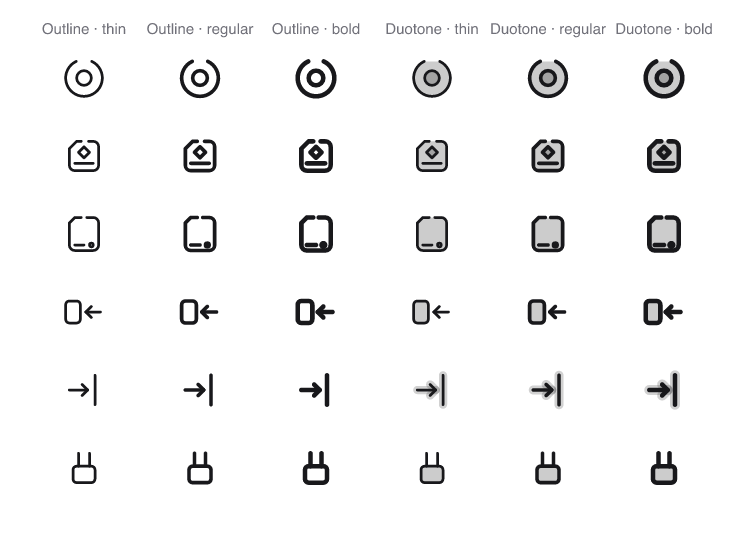

<p align="center">
  <picture>
    <source media="(prefers-color-scheme: dark)" srcset=".github/assets/preview-dark.png">
    
  </picture>
</p>

<h1 align="center">IconMind</h1>

<p align="center">
  Open-source icons for AI-era software —<br>
  LLMs, agents, MCP, RAG, and everything around them.
</p>

<p align="center">
  <a href="https://iconmind.dev"><b>Website</b></a> ·
  <a href="https://iconmind.dev/icons/"><b>Browse all icons</b></a> ·
  <a href="https://iconmind.dev/collections/"><b>Collections</b></a> ·
  <a href="https://iconmind.dev/docs/installation/"><b>Docs</b></a> ·
  <a href="https://iconmind.dev/docs/mcp/"><b>MCP server</b></a>
</p>

<p align="center">
  <a href="LICENSE"></a>
  
  
  <a href="https://www.npmjs.com/package/@iconmind/react"></a>
  <a href="https://pub.dev/packages/iconmind_flutter"></a>
</p>

---

```tsx
import { Agent, ContextWindow, VectorDatabase } from "@iconmind/react";

<Agent />
<ContextWindow variant="duotone" weight="bold" />
<VectorDatabase size={32} className="text-violet-500" />
```

**2,287 icons · 13,722 drawings · 10 packages · one generated source of truth.**

Every icon is a declaration compiled into six cells by a validator that refuses geometry
it cannot draw correctly, and a nightly job rasterises all 13,722 of them and fails if any
two icons render the same. That is how a set this size still reads as one hand — and why
an assistant can be handed [an MCP server](https://iconmind.dev/docs/mcp/) that returns
real names instead of `<AgentBrain />`.

## Why this exists

Build a UI for an agent, a RAG pipeline, or an MCP server and you run out of icons
almost immediately. There is no `context-window`, no `reranker`, no `tool-calling`, no
`mcp-resource` in any mainstream set — so interfaces reach for a generic robot, a generic
database, a generic lightning bolt, and the meaning is lost.

Lucide, Heroicons and Phosphor are excellent, and a thousand domain-specific AI icons
would be scope creep for any of them. **IconMind sits next to them, not instead of
them** — the 24px grid and 2px regular stroke match Lucide on purpose, so the two can
share an interface without clashing.

| | IconMind | Generalist sets |
|---|---|---|
| Vocabulary | AI, agents, MCP, RAG, data, devops | General UI |
| Grid | 24px, 2px stroke | Usually the same |
| Variants | 6 drawings per concept | Usually 1–2 |
| Consistency | Machine-enforced geometry | Reviewed by eye |
| For AI assistants | Built-in MCP server | — |

## The set

**2,287 icons · 12 domains · 6 cells each.** Two variants — outline and duotone — each
drawn at three weights (1.5 / 2 / 2.5). A weight is a real drawing constraint, not a
`stroke-width` slider: gap and legibility rules tighten as the stroke grows, and the
validator checks every cell separately.

Duotone is **derived, never drawn**: every closed body tints at 20% behind the strokes,
and icons made only of open marks (a check, an arrow) get a halo — the same paths echoed
wider behind them — so the whole set answers the variant switch, not just the lucky icons.

<p align="center">
  <picture>
    <source media="(prefers-color-scheme: dark)" srcset=".github/assets/variants-dark.png">
    
  </picture>
</p>

| | | |
|---|---|---|
| **AI & LLM** — models, prompts, tokens, embeddings, evaluation, safety | **Agents** — planning, memory, tool use, computer use, multi-agent | **MCP** — servers, clients, resources, tools, transports |
| **RAG & Search** — chunking, retrieval, ranking, vectors, grounding | **Data Engineering** — pipelines, warehouses, streaming, quality | **DevOps** — CI/CD, containers, observability, incidents |
| **Cloud** — compute, storage, network, edge, cost | **Security** — auth, secrets, policy, AI security | **Automation** — workflows, triggers, conditions, human-in-the-loop |
| **Analytics** — charts, metrics, experiments, LLM observability | **Developer Tools** — code, terminal, VCS, API, testing | **Interface** — arrows, actions, states, layout, media |

## Install

| Stack | Install |
|---|---|
| [React](https://iconmind.dev/docs/react/) | `npm i @iconmind/react` |
| [Vue 3](https://iconmind.dev/docs/vue/) | `npm i @iconmind/vue` |
| [Svelte](https://iconmind.dev/docs/svelte/) | `npm i @iconmind/svelte` |
| [Solid](https://iconmind.dev/docs/solid/) | `npm i @iconmind/solid` |
| [Preact](https://iconmind.dev/docs/preact/) | `npm i @iconmind/preact` |
| [React Native](https://iconmind.dev/docs/react-native/) | `npm i @iconmind/react-native react-native-svg` |
| [Astro](https://iconmind.dev/docs/astro/) | `npm i @iconmind/astro` |
| [Flutter](https://pub.dev/packages/iconmind_flutter) | `flutter pub add iconmind_flutter` |
| [Laravel Blade](https://iconmind.dev/docs/laravel/) | `composer require iconmind/blade-iconmind` |
| [Plain SVG / sprite](https://iconmind.dev/docs/svg/) | `npm i @iconmind/icons` |

### One API, everywhere

Every framework package exposes the same component names and the same props, generated
from one source so they cannot drift:

| Prop | Default | What it does |
|---|---|---|
| `size` | `24` | Width and height |
| `color` | `currentColor` | Stroke colour |
| `variant` | `"outline"` | `"outline"` or `"duotone"` |
| `weight` | `"regular"` | `"thin"`, `"regular"` or `"bold"` — each its own drawing |
| `strokeWidth` | per weight | Fine adjustment; picking a weight redraws instead |
| `absoluteStrokeWidth` | `false` | Keeps stroke thickness constant as size changes |

The same icon in four stacks:

```tsx
// React / Preact / Solid — also Vue and Svelte with template syntax
<VectorDatabase variant="duotone" weight="bold" size={32} />
```

```dart
// Flutter — real strokes on a CustomPaint, not an icon font,
// so duotone and the weights survive intact
IconMind(IconMindIcons.vectorDatabase,
    variant: IconMindVariant.duotone, weight: IconMindWeight.bold, size: 32)
```

```blade
{{-- Laravel — server-rendered, zero JavaScript --}}
<x-im-vector-database-duotone-bold class="w-8 h-8" />
```

```astro
---
import { VectorDatabase } from "@iconmind/astro";
---
<VectorDatabase variant="duotone" weight="bold" size={32} />
```

### Tree shaking, measured

Importing three icons costs ~660 bytes gzipped, not the whole library — and that is a
test that fails in CI if it stops being true, not a promise. Every icon is also its own
entry point (`@iconmind/react/icons/agent`). In Flutter, icons are compile-time
constants: the AOT compiler drops every one you never mention.

## Download

Every icon page has a **Download** menu — SVG, PNG at 16 to 512 px, WebP, a favicon `.ico`, JPEG and *Copy PNG* — rendered in your browser from the exact variant, weight and colour on screen. The whole set ships as two archives on every [GitHub Release](https://github.com/Iconmind/iconmind/releases): `iconmind-svg.zip` (all 13,722 cells) and `iconmind-png.zip` (one 512 px PNG per icon). It is also an [Iconify](https://icones.js.org) collection (`iconmind:agent`) and one jsDelivr URL away with no install.

## For AI assistants

There is an MCP server, so an assistant writing your UI can search the real set instead
of guessing icon names that do not exist:

```bash
claude mcp add iconmind -- npx -y @iconmind/mcp
```

It runs offline, bundles the icon data, and starts in well under a second. The site also
serves [`llms.txt`](https://iconmind.dev/llms.txt) and a full machine-readable
inventory, so assistants without tool access can still pick real names.

## No build step at all

`@iconmind/icons` ships every cell as a file on disk
(`icons/<category>/<slug>/<variant>-<weight>.svg`), a `sprite.svg` of `<symbol>`
elements, and the metadata database on its own subpath — importing it is a decision,
never an accident:

```html
<svg width="24" height="24"><use href="sprite.svg#im-agent" /></svg>
```

```js
import { getIcon, iconsIn } from "@iconmind/icons/metadata"; // tools only: ~180 KB gz
import { version } from "@iconmind/icons";                    // a few hundred bytes
```

## Design system

Icons here are **written, not drawn**: each one is a TypeScript declaration compiled
into its six cells, and every rule a machine can hold is held by a machine — an illegal
drawing cannot reach a file, because the shape constructors throw before it does:

```
24 × 24 canvas  ·  0.5 grid  ·  angles 0 / 45 / 90 only  ·  live area 2..22
round caps      ·  ≤ 2 stroke crossings  ·  ink centred within 2 units
longer side 18–22 across the whole set  ·  duotone tint 20%, halo = weight + 3
```

The vocabulary does the rest: a family shares one body and differs only in the mark
inside it, so siblings are byte-identical where they agree.

| Body | Meaning | Example |
|---|---|---|
| Open ring | An agent — acts on its own | `agent`, `agent-check` |
| Chamfered box | A machine; the chamfer is MCP's mark | `model`, `mcp-server` |
| Two-pronged plug | A capability an agent can pick up | `tool-calling`, `mcp-tool` |
| Page with a fold | A document | `mcp-resource`, `policy` |
| Squared shield | Protection | `shield-check`, `encryption` |
| Square loop | Anything that goes round | `refresh`, `retry`, `sync` |
| Cylinder | Stored data | `database`, `backup` |

So you can usually guess the next icon in a family before you see it. The full
reasoning — with the measurements behind each rule — is in the
[design guidelines](https://iconmind.dev/docs/design-guidelines/).

### Measured, not just validated

Beyond the validator, two audit tools keep the set honest at scale — both grew out of
real audits that redrew over sixty icons:

```bash
pnpm icons:audit                  # size, ink density and centred-ness outliers, with named exceptions
pnpm icons:twins                  # renders all 2,287 icons and pixel-compares every pair for lookalikes
pnpm icons:duplicates --perceptual # the nightly scan: 13,722 cells, fails on two that render alike
```

## Versioning & releases

All npm packages share one version (currently in lock-step with `iconmind_flutter` on
pub.dev), and releases are fully automatic: every merged change steps the patch version,
publishes all packages, tags, cuts a GitHub Release and redeploys the site. What you
see on npm is never ahead of or behind the repo.

## FAQ

**Why is there no CommonJS build?** Providing one would provide a path that does not
tree-shake well, and some bundlers would silently choose it. ESM only.

**Why only 0/45/90° angles?** It is the constraint that makes 2,287 icons read as one
hand. Some pictures are refused rather than drawn badly — a warning triangle at 45° is
a tent, so `warning` is a circle.

**Can I request an icon?** Yes — it takes a minute and is the most useful contribution
there is: [request an icon](https://github.com/iconmind/iconmind/issues/new?template=icon-request.yml).

**Brand icons?** No. Concepts age better than logos, and logos carry trademark weight
this set does not want.

**Is there a Figma library?** No, and none is planned — it would be a second source of
truth beside the compiler. The set is an [Iconify](https://icones.js.org) collection
(`iconmind:agent`), which Iconify's own Figma plugin reads, and every icon page copies
or downloads its SVG.

**How do I pick between IconMind and Lucide/Tabler/Heroicons?** There are
[comparison pages](https://iconmind.dev/compare/) with the counts, licences and
trade-offs written out.

## Contributing

Icons are TypeScript declarations in `scripts/draw/icons/` — the compiler and validator
give you feedback in seconds, and a contact sheet renders any subset at 88/24/16px:

```bash
pnpm install
pnpm icons:build       # draw every icon from source
pnpm icons:validate    # every rule, all 13,722 cells
pnpm icons:audit       # the consistency measures
```

See the [contributing guide](CONTRIBUTING.md) for naming rules, originality policy and
the pull-request checklist.

Ten icons are [described down to their body and mark slot](https://github.com/Iconmind/iconmind/issues?q=is%3Aissue+is%3Aopen+label%3A%22good+first+icon%22)
if you want one to start from — the drawing is the fun part, the rules are the tools' job.

## Support the project

If this set saves you from mapping `reranker` to a generic sort icon, a ⭐ helps other
people building AI interfaces find it.

## License

[MIT](LICENSE) — code and icons alike. Free for commercial use, no attribution
required, no conditions. Forever.
